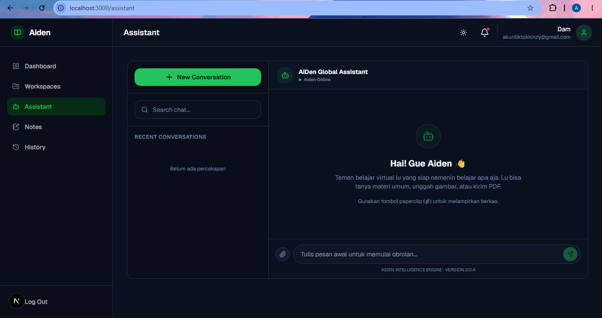

<p align="center">
  
</p>

<h1 align="center">AIDEN</h1>

<p align="center">
  Modern AI-Powered Study Platform built with Next.js, Supabase & Google Gemini API
</p>

<p align="center">
  <a href="https://aiden-v2.vercel.app">🌐 Live Demo</a>
</p>

---

## ✨ Overview

**Aiden** is a modern, AI-powered study platform designed to revolutionize the way students and professionals learn. 

It allows users to organize learning material into dedicated Workspaces, generate AI-powered Flashcards and Quizzes, summarize long study notes, write personal documents, and consult with a context-aware AI Chat Assistant.

Aiden focuses on sleek modern design, real-time interactivity, and productivity-boosting features to make studying smarter, not harder.

> ⚠️ Google Gemini API Key and Supabase project configurations are required to run the AI and database features.

---

## 🚀 Features

- 📁 **Workspace Terpusat** (Group learning materials into organized folders)
- ⚡ **AI Flashcard Generator** (Instantly generate custom study flashcards using AI)
- 📝 **AI Quiz & Question Generator** (Auto-generate practice quizzes to test your knowledge)
- 🧠 **AI Smart Summary** (Condense long notes or text into structured, easy-to-read summaries)
- ✍️ **Built-in Notes Editor** (Create and manage manual notes within each workspace)
- 💬 **AI Chat Assistant** (Context-aware chat bot that understands your workspace contents)
- 📋 **Activity History & Logs** (Keep track of all study resources and modifications)
- 🔔 **Real-time Notifications** (Get notified for system updates and user actions)
- 🔐 **Supabase & Google Authentication** (Secure login and protected router setup)
- 🎨 **Modern Dark & Light UI** (Beautiful interface built with Tailwind CSS and Framer Motion)

---

## 🛠️ Tech Stack

| Category        | Technology |
|----------------|-----------|
| Frontend       | Next.js (App Router) / React.js |
| Styling        | Tailwind CSS (v4) + Radix UI |
| Backend (BaaS) | Supabase (Authentication & PostgreSQL Database) |
| AI Integration | Google Gemini API (via Vercel AI SDK) |
| Animation      | Framer Motion |
| Icons          | Lucide React |
| Notification   | SweetAlert2 |

---

## 📸 Screenshot

<p align="center">
  
</p>

---

## 🔐 Authentication

- Google Sign-In & Email Password (Supabase Auth)
- Protected route middleware for dashboard, workspace, profile, and settings pages
- Secure row-level security (RLS) policies on Supabase tables

---

## 🛠️ Build and Dev

- Clone repository
 ```sh
  git clone https://github.com/denfasyah/aidenv2.git
 ```

- Install dependencies
 ```sh
  npm install
 ```

- 🔑 Environment Variables (Create a `.env.local` file and fill it in like this :)
 ```env
  NEXT_PUBLIC_SUPABASE_URL=your_supabase_project_url
  NEXT_PUBLIC_SUPABASE_ANON_KEY=your_supabase_anon_key
  GEMINI_API_KEY=your_gemini_api_key
 ```

- Run development server
 ```sh
  npm run dev
 ```

---

## 📈 Future Improvements

- 📄 **PDF Parser** (Upload study PDFs and let the AI process them automatically)
- 👥 **Collaborative Workspaces** (Study together with your friends in real-time)
- 📊 **Learning Progress Statistics** (Track quizzes completed and flashcards mastered)
- ⚙️ **Advanced Profile Settings** (Custom notification preferences and interface customizers)
  
---

## 📬 Contact / Feedback
> If you have any feedback, suggestions, or issues:

- 📩 Feel free to reach out via GitHub Issues
- 💬 Or contact me directly
